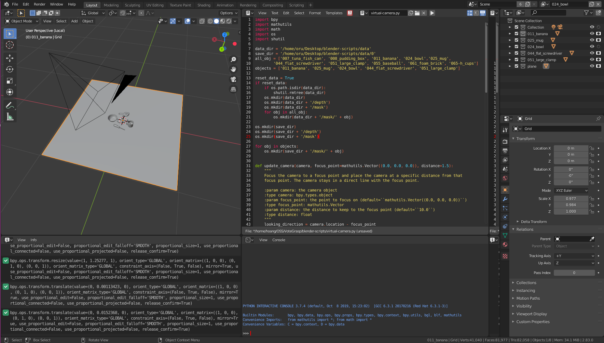
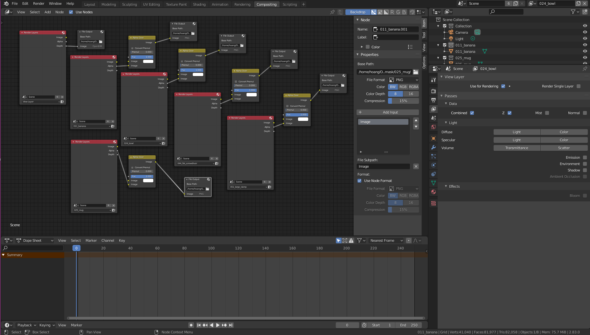
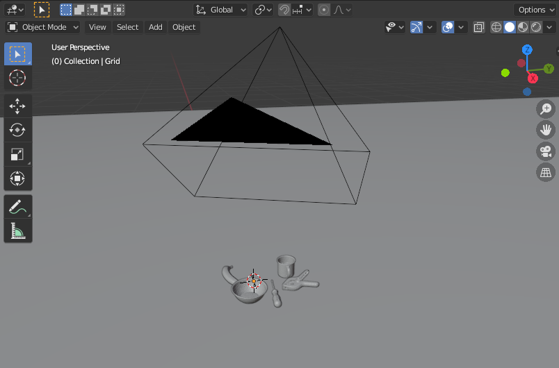

# Blender scripts for capturing depth images of a scene

The scripts were tested on [Blender 2.83](https://download.blender.org/release/Blender2.83/)  

To convert masks to semantic images, please run the python script mask2semantic.py in the folder /tools  

You can [download](http://ycb-benchmarks.s3-website-us-east-1.amazonaws.com/) and import more YCB models into Blender   

You can change directories in compisiting to specify where to save depth mask and depth images.

You can find a example of output in folder [data/0](https://github.com/votegrasp/blender-scripts/tree/master/data/0)
