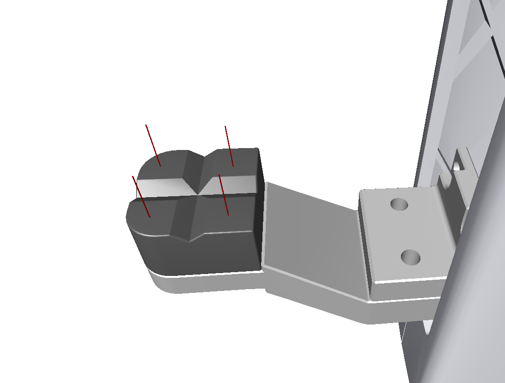

<h1>GraspIt!</h1>
This repository is a modification version of Graspit! for our VoteGrasp paper. <br />

Please see the User Manual found at http://graspit-simulator.github.io/ for an introduction to GraspIt!, a list of
features, installation instructions, getting started examples, etc.

Installation - Ubuntu Linux
---------------------

Install the following dependencies: <br />

   ```bash
sudo apt-get install libqt4-dev
sudo apt-get install libqt4-opengl-dev
sudo apt-get install libqt4-sql-psql
sudo apt-get install libcoin80-dev
sudo apt-get install libsoqt4-dev
sudo apt-get install libblas-dev
sudo apt-get install liblapack-dev
sudo apt-get install libqhull-dev
sudo apt-get install libeigen3-dev
   ```
Build GraspIt!  <br />

   ```bash
cd graspit
export GRASPIT=$PWD
mkdir build
cd build
cmake ..
make
   ```


Grasp Planning
---------------------
Open /worlds/franka_banana.xml (load Franka gripper and a banana) <br />
Grasp->EigenGrasp Planner (menu) <br />
select Axis-angle as Space Search Type <br />
select Hand Contacts as Energy formulation <br />
check the Preset contacts box. <br />
select Sim. Ann. as Planner Type <br />
set 70000 as Max Steps <br />
click Init <br />
click >   <br />
allow the planner to run until finished. <br />
use the Show Results buttons ( < Best > ) to see the results. <br />
After press Best button, a grasp.txt file will be saved to graspit/build.

 

Create Contacts
---------------------
add sphere , add hand (see /worlds/franka_sphere.xml) <br />
menu -> grasp -> virtual contacts <br />
bump the sphere into the hand, and click mark contact. Do this several times, then click save in the virtual grasp window. <br />
save contacts to /models/robots/franka_gripper/virtual/contacts.vgr  <br />




Useful Links
---------------------

https://github.com/curg/graspit_interface <br />
https://github.com/JenniferBuehler/graspit-pkgs <br />
https://github.com/ros-interactive-manipulation/graspit_simulator <br />
https://github.com/OSUrobotics/graspit_ros_plannings <br />
