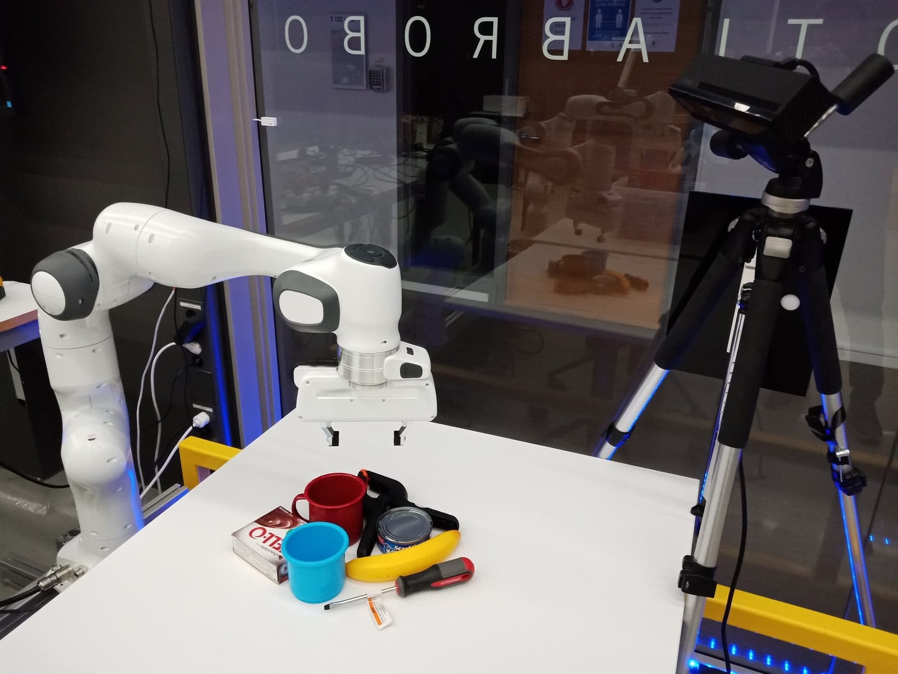

## Install
Require full ROS installation. The installation assumes you have Ubuntu 16.04 LTS [ROS Kinetic]
1. install franka_ros from source first: https://github.com/votegrasp/real_robot_grasping/tree/master/franka_ros
2. then install this: https://github.com/votegrasp/real_robot_grasping/tree/master/panda_demos
3. sudo apt-get install ros-kinetic-joint-state-controller
4. sudo apt install ros-kinetic-moveit
5. sudo apt-get install ros-kinetic-ros-control* ros-kinetic-gazebo-ros-control



## On robot side (Franka robot and computer in RobotLab)
#### To build
   ```bash
   $ catkin_make -DFranka_DIR=/home/frankanuc03/libfranka/build
   ```
   
#### To move to initial pose
```bash
   $ roslaunch franka_tminplan joint_point_to_point_motion_my.launch
 ```
#### To start planning using MoveIt!
```bash
   $ roslaunch panda_table_launch panda_moveit_interface.launch
   ```
#### To make the gripper ready
   ```bash
   $ roslaunch franka_gripper franka_gripper.launch robot_ip:=172.16.0.103
   ```
#### To subscribe "/votegrasp/width" topic and publish a grasp configuration
   ```bash
   $ roslaunch franka_tminplan test_grasp_node.launch
   ```
#### To publish a topic "/votegrasp/width" (Just for initial test)
   ```bash
   $ rostopic pub /votegrasp/width std_msgs/Float64 0.03
   ```
## On remote side ([code](https://github.com/votegrasp/simulation_grasping/tree/master/franka_vision_manipulation))
#### To subcribe topic "/votegrasp/grasp" for a grasp configuration, plan grasping by graspit, and publish topic "/votegrasp/width" to close gripper
   ```bash
   $ roslaunch move_franka execute_grasp.launch
   ```
#### To test planning for a grasp:
   ```bash
   $ rostopic pub /votegrasp/grasp std_msgs/Float64MultiArray """
    layout:
        dim: []                                
    data: [-0.29, -0.25, 1.3, 180, 0, 90, 0.06]
    """
   ```
   
## Calibration:
https://github.com/jhu-lcsr/aruco_hand_eye <br/>
