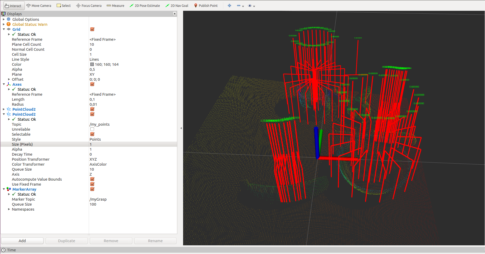
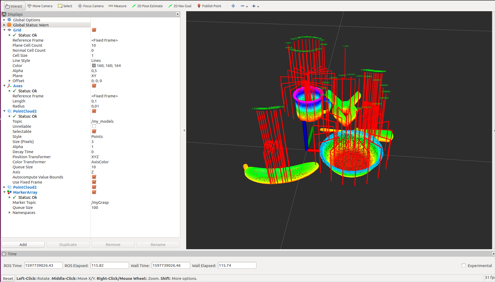

The tools require full ROS installation. The installation assumes you have Ubuntu 16.04 LTS [ROS Kinetic]

1. Build
   ```bash
   $ cd ~/catkin_ws
   $ catkin_make --pkg ros_votegrasp

2. Operate
   ```bash
   $ cd ~/catkin_ws
   $ roslaunch ros_votegrasp model2scene.launch
   $ roslaunch ros_votegrasp depth2pointcloud.launch
   $ roslaunch ros_votegrasp visualize_pointcloud.launch
   $ roslaunch ros_votegrasp visualize_grasp.launch

Note that before run depth2pointcloud.launch, you need to convert masks to semantic images using [this python script](https://github.com/hoangcuongbk80/VoteGrasp/tree/master/blender-scripts/tools) <br />




