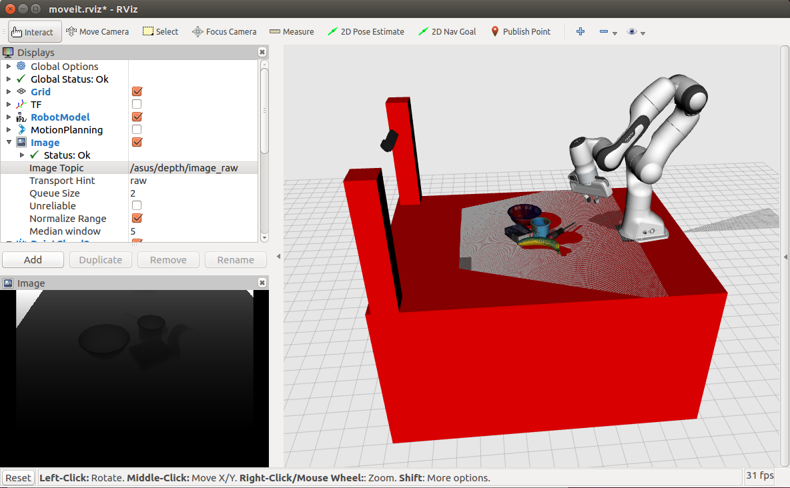

## Install
Require full ROS installation. The installation assumes you have Ubuntu 16.04 LTS [ROS Kinetic]
1. install [franka_ros](https://github.com/votegrasp/simulation_grasping/tree/master/franka_ros) 
2. then install [package](https://github.com/votegrasp/simulation_grasping/tree/master/franka_vision_manipulation)
3. sudo apt-get install ros-kinetic-joint-state-controller
4. sudo apt install ros-kinetic-moveit
5. sudo apt-get install ros-kinetic-ros-control* ros-kinetic-gazebo-ros-control

## To start a Panda and an RGBD camera simulation:
   ```bash
   $ roslaunch panda_table_description panda_gazebo_asus.launch
   ```


